<div align="center">

# 🚀 FastAPI Masterclass & Blueprint

[](https://fastapi.tiangolo.com/)
[](https://www.python.org/)
[](https://www.sqlalchemy.org/)
[](https://jwt.io/)

**An elite, production-ready collection of FastAPI projects. From fundamental CRUD operations to advanced JWT authentication and modular architectures.**

[Features](#-key-features) • [Tech Stack](#-tech-stack) • [Architecture](#-architecture--workflow) • [Getting Started](#-getting-started) • [Endpoints](#-api-endpoints)

</div>

---

## 🌟 Overview

Welcome to the ultimate **FastAPI Masterclass Repository**! This isn't just a codebase; it's a carefully crafted learning journey designed to take you from a FastAPI beginner to a seasoned backend engineer. 

Here, you'll find three distinct architectural patterns:

1. 🟢 **Core CRUD API** (`main.py`): The bedrock of backend development. Learn to integrate SQLAlchemy, manage sessions, and build robust RESTful endpoints.
2. 🔐 **JWT Authentication Service** (`service_jwt.py`): A laser-focused implementation of secure authentication using JSON Web Tokens and OAuth2.
3. 🚀 **Advanced Modular App** (`todo/` directory): A scalable, production-grade architecture featuring custom middlewares, structured routing, exception handling, and Alembic migrations.

---

## ✨ Key Features

- **🔐 Bulletproof Security:** Complete OAuth2 password flow with stateless JWT authentication (`python-jose` & `passlib`).
- **🗄️ Database Mastery:** Seamless SQLAlchemy ORM integration with a scalable session management strategy.
- **🏗️ Scalable Architecture:** Clear separation of concerns—Models, Schemas, CRUD logic, and Routes are elegantly decoupled.
- **⚡ High Performance:** Leverages FastAPI's async capabilities and automatic OpenAPI (Swagger) documentation generation.

---

## 🛠️ Tech Stack

| Technology | Purpose |
| :--- | :--- |
| **[FastAPI](https://fastapi.tiangolo.com/)** | High-performance, async-ready web framework |
| **[SQLAlchemy](https://www.sqlalchemy.org/)** | The standard for Python SQL tooling & ORM |
| **[Alembic](https://alembic.sqlalchemy.org/)** | Database migrations made easy |
| **[Pydantic](https://pydantic-docs.helpmanual.io/)** | Data validation and settings management |
| **`passlib` & `bcrypt`** | Industry-standard password hashing |
| **`python-jose`** | Robust JWT encoding and decoding |

---

## 📐 Architecture & Workflow

Understanding the authentication lifecycle is crucial. Below is the exact workflow implemented in our JWT Service:

```mermaid
sequenceDiagram
    autonumber
    actor Client
    participant API as FastAPI Application
    participant Auth as Auth Dependency (OAuth2)
    
    rect rgb(30, 41, 59)
        note right of Client: 1. Login Phase
        Client->>API: POST /login (username, password)
        API->>API: Validate Credentials
        API-->>Client: Returns JWT Access Token
    end
    
    rect rgb(15, 23, 42)
        note right of Client: 2. Protected Resource Access
        Client->>API: GET /secure (Header: Bearer <Token>)
        API->>Auth: Extract Token from Header
        Auth->>Auth: Decode & Verify Expiry/Signature
        alt is Valid
            Auth-->>API: Yields Current User
            API-->>Client: 200 OK (Returns Protected Data)
        else is Invalid/Missing
            Auth-->>Client: 401 Unauthorized (Access Denied)
        end
    end
```



---

## 📂 Project Structure

Navigating the codebase is a breeze. Everything is exactly where you'd expect it to be.

```text
📦 fastapi-masterclass
 ┣ 📂 todo/                     # 🚀 Project 3: The Production-Grade App
 ┃ ┣ 📂 alembic/                # Migration history & scripts
 ┃ ┣ 📂 app/                    # Core business logic
 ┃ ┃ ┣ 📂 config/               # Environment & App Configs
 ┃ ┃ ┣ 📂 database/             # SQLAlchemy engine & sessions
 ┃ ┃ ┣ 📂 models/               # Database tables
 ┃ ┃ ┣ 📂 routing/              # Modular API endpoints
 ┃ ┃ ┗ 📂 schema/               # Pydantic validation models
 ┃ ┣ 📜 main.py                 # Application entry point
 ┃ ┗ 📜 middleware.py           # Custom request interceptors
 ┃
 ┣ 📜 main.py                   # 🟢 Project 1: Core CRUD App Entry
 ┣ 📜 crud.py                   # Reusable DB operations
 ┣ 📜 models.py                 # SQLAlchemy definitions
 ┣ 📜 schemas.py                # Pydantic data models
 ┣ 📜 database.py               # Connection setup
 ┣ 📜 security.py               # Bcrypt password hashing
 ┃
 ┣ 📜 service_jwt.py            # 🔐 Project 2: Standalone JWT Service
 ┣ 📜 app.py                    # 🧪 Experimental sandbox (Decorators, Generators)
 ┗ 📜 .env                      # Environment variables
```

---

## 🚀 Getting Started

Ready to spin up the servers? Follow these simple steps:

### 1. Clone & Prepare
```bash
git clone <your-repository-url>
cd fastapi
```

### 2. Virtual Environment
It's highly recommended to use a virtual environment to keep dependencies clean.
```bash
python -m venv venv

# Windows
venv\Scripts\activate
# macOS/Linux
source venv/bin/activate
```

### 3. Install Dependencies
```bash
pip install fastapi uvicorn sqlalchemy python-dotenv passlib[bcrypt] python-jose[cryptography] alembic
```

---

## 🕹️ Running the Apps & Endpoints

### 🟢 Project 1: Core CRUD API
Run the foundational CRUD application:
```bash
uvicorn main:app --reload --port 8000
```
**Interactive Docs:** [http://localhost:8000/docs](http://localhost:8000/docs)

| Method | Endpoint | Description |
| :--- | :--- | :--- |
| `POST` | `/users` | Create a new user (hashes password) |
| `GET` | `/users/` | Fetch all registered users |
| `GET` | `/getdatabyid/{user_id}`| Fetch a specific user by ID |
| `PUT` | `/updatedata/{user_id}` | Update user information |
| `DELETE`| `/deletedata/{user_id}` | Remove a user |

---

### 🔐 Project 2: JWT Auth Service
Run the standalone authentication server:
```bash
uvicorn service_jwt:app --reload --port 8001
```
**Interactive Docs:** [http://localhost:8001/docs](http://localhost:8001/docs)

| Method | Endpoint | Description |
| :--- | :--- | :--- |
| `POST` | `/login` | Authenticate and receive a JWT |
| `GET` | `/secure` | **(Protected)** Requires a valid Bearer token |

---

### 🚀 Project 3: Modular App (Advanced)
Dive into the structured application. *(Ensure your database is configured in `.env` and migrations are run if applicable).*
```bash
cd todo
uvicorn main:app --reload --port 8002
```
**Interactive Docs:** [http://localhost:8002/docs](http://localhost:8002/docs)

---

<div align="center">
  <br/>
  <i>Engineered with excellence. Build the future with FastAPI.</i>
  <br/>
  <b>⭐️ If you find this repository helpful, don't forget to star it! ⭐️</b>
</div>
